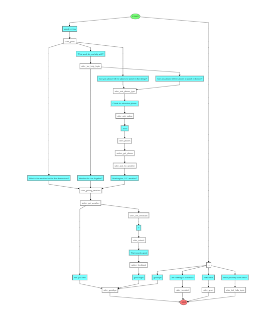

# PlaceBot
CMPE-252 (Final Project Chatbot suggesting tourist places nearby user)

This chatbot is a conversational AI built using the open-source Rasa framework. Its purpose is to provide helpful information and assistance to users on a variety of topics.

## Details
* Drona Kaushik Jagad
  * dronakaushik.jagad@sjsu.edu
  * 016651206
  * MS AI

## Problem Statement

There are a lot of people who love to travel but don’t know where to go, how to commute or what to carry. In order to find answers to this, people had to go through endless blogs and websites which can even mislead them at times. 

#### Solution: Created an AI powered bot for suggesting solutions in regards to customized needs of the users in the travel section. It’s a one stop solution for everyone travelling to USA, helps looking for weather and tourist places.

## Requirements

- Rasa 3.0 or higher
- Python 3.7 or higher (Here using 3.8)
- Using Postgres for storing the required data from the user

## APIs used 

- Geoapify - API suggesting the nearby places using user’s location and giving radius as parameter.
- Openweathermap - API telling about the weather as per given user’s location.   

## Installation

1. Clone this repository
```
git clone https://github.com/DJagad/PlaceBot.git
```

2. Install the required dependencies
```
pip install -r requirements.txt
```

3. Train the chatbot's natural language processing model by running the following command
```
rasa train
```

4. Run the custom actions file which is used to run the APIs created for this particular chatbot
```
rasa run actions
```

5. Start the chatbot server by running the following command
```
rasa run
```

{To run the chatbot in shell run the following command}
```
rasa shell
```

## File Structure

- The `data` directory contains the training data for the chatbot's natural language processing model, including training examples and NLU annotations.
- The `models` directory contains the trained model files generated during the training process.
- The `actions` directory contains the code for the custom actions that the chatbot can perform.
- The `config.yml` file contains the configuration for the chatbot, including the NLU and Core model settings.

## Dialogue Flow

One example for the dialogue flow is shown below
```
Your input ->  Hey

Hey! How are you?

Your input ->  Can you tell about yourself?     

I am PlaceBot, I suggest the attraction and sight seeing spots nearby your location and tells about the weather for the given location

Your input ->  Can you please tell me places to watch in Boston? 

Can you please specifiy the type of tourist places looking for?
 [As of now we can show two types of Tourist places :- (Sight Seeing and Attraction Places)]
 1. Sight Seeing Places 
 2. Attraction Places
 
Your input ->  sights              

Can you please specify the radius (in meters)?

Your input ->  10000 meters   

Ok, sights places to watch nearby the Boston....
1. Swan Boats
         Address:- Swan Boats, 4 Charles Street, Boston, MA 02116, United States of America
2. The Fairmont Copley Plaza Hotel
         Address:- The Fairmont Copley Plaza Hotel, 138 Saint James Avenue, Boston, MA 02116, United States of America
3. John F. Andrew House
         Address:- John F. Andrew House, 32 Hereford Street, Boston, MA 02115, United States of America
4. Ayer Mansion
         Address:- Ayer Mansion, 395 Commonwealth Avenue, Boston, MA 02115, United States of America
5. UBC Clubhouse
         Address:- UBC Clubhouse, 144 Chestnut Street, Boston, MA 02108, United States of America
         
Do you want to know about the weather?

Your input ->  Tell me weather of Boston? 

Ok, getting weather of Boston...

It is currently Clear in Boston at theat the moment. The temperature is 280.11 degrees, the humidity is 23% and the wind speed is 8.23 mph. 
Please provide the feedback for the PlaceBot

Your input ->  yes   

These are the values that you provided [To store this values, press Y/Yes]: 
 Location:- Boston
 Types_of_place:- sights
 Radius:- 10000
 Weather_Location:- Boston
 
Your input ->  yes    

Thanks for your valuable feedback.

Your input ->  Bye  

Bye
```

Another example for the dialogue flow is shown below 

```
Your input ->  Hey  

Hey! How are you?

Your input ->  What you help the users with                                                                                                  

I am PlaceBot, I suggest the attraction and sight seeing spots nearby your location and tells about the weather for the given location       

Your input ->  Can you suggest some places nearby San Jose?                                                                                  

Can you please specifiy the type of tourist places looking for?

[As of now we can show two types of Tourist places :- (Sight Seeing and Attraction Places)]
 1. Sight Seeing Places
 2. Attraction Places

Your input ->  attraction places                                                                                                             

Can you please specify the radius (in meters)?

Your input ->  50000                                                                                                                         

Ok, attraction places to watch nearby the San Jose....
1. Winchester Mystery House
         Address:- Winchester Mystery House, 525 South Winchester Boulevard, San Jose, CA 95128, United States of America
2. Japanese Friendship Garden
         Address:- Japanese Friendship Garden, Senter Road, San Jose, CA 95110-2939, United States of America
3. Hewlett Packard's Garage
         Address:- Hewlett Packard's Garage, 367 Addison Avenue, Palo Alto, CA 94301, United States of America
4. Municipal Rose Garden
         Address:- Municipal Rose Garden, Rose Garden, San Jose, CA, United States of America
5. Santa Clara County Fairgrounds
         Address:- Santa Clara County Fairgrounds, 344 Tully Road, San Jose, CA 95111, United States of America

Do you want to know about the weather?

Your input ->  Can you tell about San Jose Weather?

Ok, getting weather of San Jose...
It is currently Clouds in San Jose at theat the moment. The temperature is 286.01 degrees, the humidity is 71% and the wind speed is 2.57 mph.
Please provide the feedback for the PlaceBot

Your input ->  yes   

These are the values that you provided [To store this values, press Y/Yes]: 

Location:- San Jose
 Types_of_place:- attraction
 Radius:- 50000
 Weather_Location:- San Jose
 
Your input ->  yes    

Thanks for your valuable feedback.

Your input ->  Bye  

Bye

```

Another story for finding the weather of the particular position

```
Your input ->  hi                                                                                                                            

Hey! How are you?

Your input ->  What you help users with?                                                                                                     

I am PlaceBot, I suggest the attraction and sight seeing spots nearby your location and tells about the weather for the given location       

Your input ->  Can you tell about weather of Texas?                                                                                          

Ok, getting weather of Texas...

It is currently Clouds in Texas at theat the moment. The temperature is 293.81 degrees, the humidity is 60% and the wind speed is 2.57 mph.  

Your input ->  Bye                                                                                                                           

Bye
```

For obtaining the graph for dialogue flow, the code is given below
```
rasa visualize
```

Output of the `rasa visualize`


